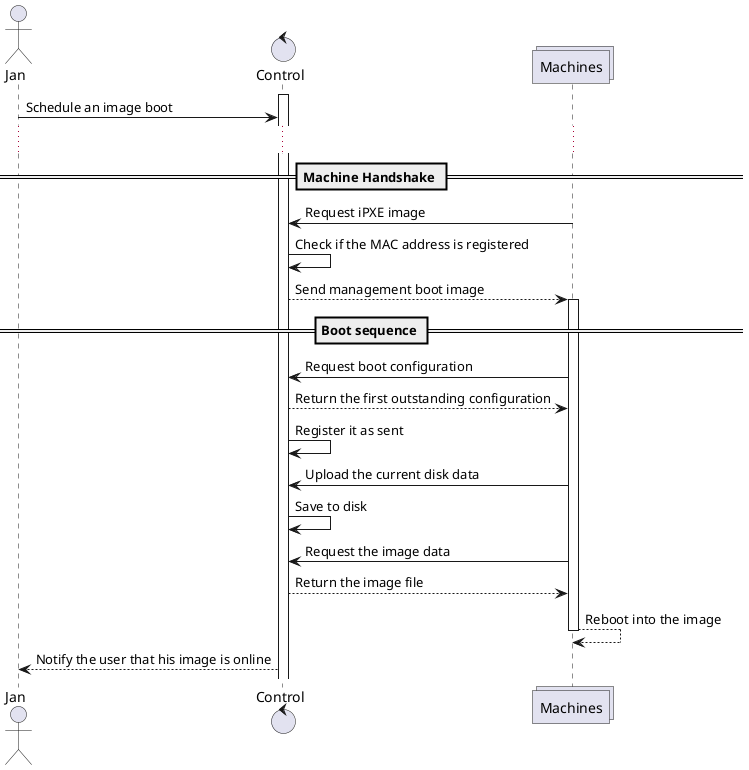

#  Control Server
First of the two major components of the BAAS project is the Control Server which forms the core of the program and allows users to access the various features of the project. It coordinates access to the machines, manages images and deals with logic of flashing those images to the machines. Users can access the control server using a public REST API or the official web frontend.

Currently the control server is implementation is concentrated in three main parts: a iPXE server, REST API and a machine API. The former is implemented in the `pixieserver` package and consists mostly out of some boilerplate around the `pixiecore` library.  For the latter two, they are implemented in the `api` subdirectory and they overlap as much as possible.

# Overview of how the typical interaction works
When the control server is run the server will open a SQL database and start a HTTP server. If a machine on the network boots, it will receive a DHCP message over the network. First it will confirm if sent from a register MAC address and offer the management OS to the server.

Once the management OS is booted it will request a boot configuration from the server. The server will sent the first outstanding user request to the server. A boot configuration indicates whether the current state of the machine should be saved, the location of the image that should be booted and any information about images such as compression algorithm.

# Control Server and Management OS interaction

