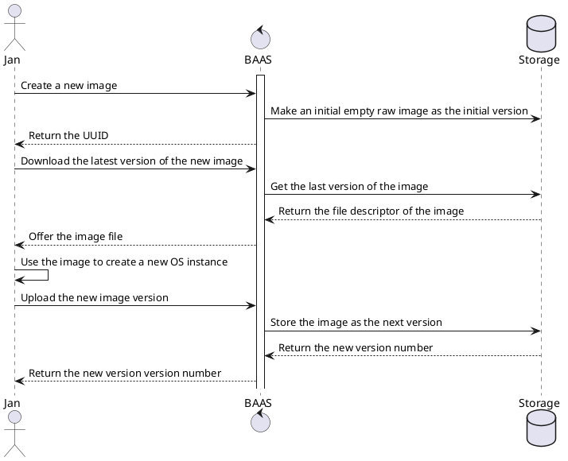

# Structure and Implementations of BAAS Images
Central to the workings of the BAAS Project is, of course, the images
which the users are interested in running on the machines. In essence
this project is nothing more than catalogue of various images with
convience functions to flash them to computers and manage their
data. Naturally, this means that design of how images look like and
how they function are of paramount importance of the quality of the
project.

## What are images?
To put it simply,
[images](https://www.pcmag.com/encyclopedia/term/disk-image) are files
which contain raw disk data which can be flashed onto a storage
medium. Data can be normal files such as videos or images, but also
more complex data like copies of a hard drive. After flashing an image
of the latter type, the computer should turn into an exact replica of
the original source machine. The BAAS project automates the creation
of initial images, flashing them to powerful machines, and ensures
that the images are kept up to date. Images, for now, can only contain
one partition. More complicated setups can be created with image
setups for the small additional overhead of the filesystem metadata.

## How do images look like?
On the server images are stored in the `/disk` directory where they
each get assigned a subdirectory named after their UUID. There every
version of the image is numbered and stored on disk as `.img` file. In
the database more information about the image is stored as well: What
image kind of image is it? What are the associated images? Which file
standard is used? What compression algorithm was used at creation?
Also stored is the target disk file and the transfer protocol used,
which are set for all version of the images across all machines.

```plantuml

class Image {
   string uuid
   ---
  * string type
  * string user
  * string name
}

class User {
   string email
   ---
   string name
   string role

}

class ImageSetup {
   int id
   ---
   * id targetVersion
   * boolean upload
   * user User
}

class Version {
   * image Image
   * int currentVersion
}

class ImageFrozen {
   * image Image
   * version Version
}

class ImageSetup {
   * ImageFrozen images
   * string Name
}

Image --|{ Version
Version --o{ ImageSetup
User ---{ ImageSetup
User ---{ Image
Image ---{ ImageFrozen
ImageSetup --{ ImageFrozen
```

## What kind of images are there?
Currently, the only images that are supported are single images which
contain all the partitions to setup the system. They are linked to a
particular user and can be updated by the given user or an
administrator. In the future, the aim is to support various different
image types which allows for incremental and grandular configuration
of the system.

### Boot images
Boot images contain just enough information to boot the system into a
kernel and bootstrap the operating system. These are minimal images
which serve to decrease the amount of time that the server needs to
stay in the management mode.

### System images
System images are all the data on the disk which define an unique
version of that operating system in question. In other words, they are
all the files on a GNU/Linux system which are not in temporary
folders, `/home` or `/boot`. These images can only be changed by
administrators or other high privileged users. It may be possible to
generate these images on the spot, or at least initially, using
Dockerhub as a source.

### User data images
User data images are similar to the `/home` directory on a GNU/Linux
system. It contains all the user specific information and is used to
share data across different system images. Changes to these images are
always synced to the data source on the server so data is never
lost. These images can either be flashed together with a system image
or they can be mounted as a network share. Although the latter is
slower to access data, it does mean that the image can be booted much
faster than the former.

### Temporal images
Temporal images are data sources which are stored for a temporary
period of time and are discarded soon afterwards. These images can be
used to store research data over a short period time and avoid the
overhead of downloading the heavier user image.

### Custom init images
These images contain binaries which are loaded on the first boot. A
use case for this would be a researcher which wants to boot the same
system image, but set a particular kernel parameter to a slightly
different value. He or she would store the current state in a temporal
image, read that in the boot, set the value, write the experiment to
the temporal image and automatically reboot.

## How do I create an image?
At the time of writing only simple RAW disk images are supported, but
more standards do exist. They can be created by sending a POST request
to the `/user/[name]/image` endpoint which create a personal disk
image. Doing so will create a six gigabyte disk image on disk which
can be downloaded by the user. After this the user can add this disk
image to a virtualization program and install an operating system on
it. An updated image can be uploaded by performing a POST request to
`/image/[uuid]` which will add the updated version on disk as version
`n+1`. Alternatively, an entirely different image can be uploaded as
well if that is required.


