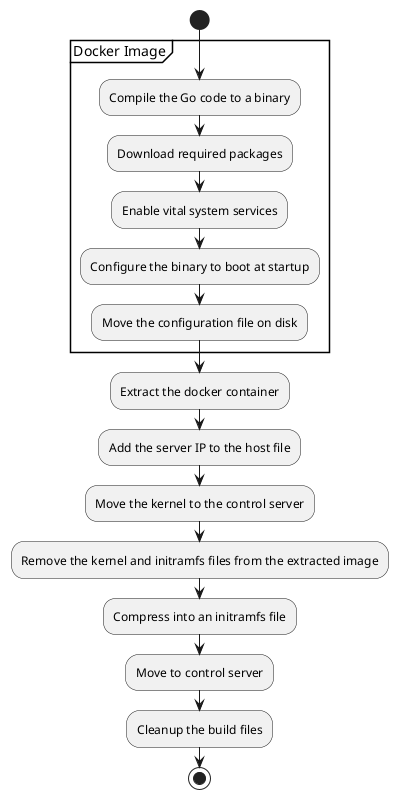
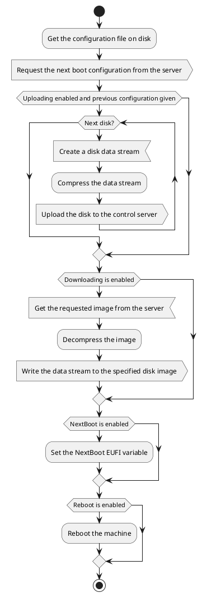

# Overview Management OS
When a machine boots it gets offered a specialized Debian GNU/Linux image over the network. This image contains the code which communicates with the *Control Server* and actually flashes the code onto the disk.

## Image Creation
Image creation is done by first generating a Docker image which is extracted and converted into a [initramfs](https://wiki.debian.org/initramfs) image. An initramfs image is a mechanism used by the Linux kernel in order to access more complicated programs, utilities and files which are not accessible to just the kernel itself. Basically, it contains all the data needed to boot the system itself. The upside of generating the image this is way is that is easy to change packages which are installed onto the management image. You can think of a new dependency, system utility or interpreter.

During the image generation the code is compiled into binary and added to the initialization processes, the IP address of the server is added to the hostfile and the kernel is extracted out of the image. A simple configuration file is added to the image as well, which is used to set various developer debugging options.

The initramfs and the kernel are moved into the `/static` directory in the *Control Server* so they can be offered to any machine requesting a network boot.

### Diagram

## Boot Sequence
At the start of the image boot a custom binary is run which functions as sequential program which runs from start to finish. First it will request the next boot configuration from the server. It will receive a JSON message with information about whether it should upload it's disk and where to, as well as information about the image it should download.

First it will, if required, create a datastream containing all the information from a device file. It will then optionally compress it with either Gunzip or Zstandard and send it over the network to the control server.

!!! warning "On the data stream"

    Please be sure that you never accidentally copy the data to RAM at any point in the program. Doing so is a sure fire
    way to get the kernel to reap your process. Always make use of the `fs.CopyStream` function when dealing with data
    and double check what any library calls does not copy it implicitly either.

Downloading the data works basically in the exact same way, but in reverse. So it will first create a stream from the server, decompress it and write it to disk.

As a final step it will set the [BootNext](https://edk2-docs.gitbook.io/edk-ii-uefi-driver-writer-s-guide/3_foundation/readme.15/31511_boot_manager_bootnext_processing) EUFI variable which is used to set the boot option for the next boot. It should, after rebooting, revert back to the standard configuration and restart this cycle. Finally, the image is rebooted into the target image.

### Diagram

